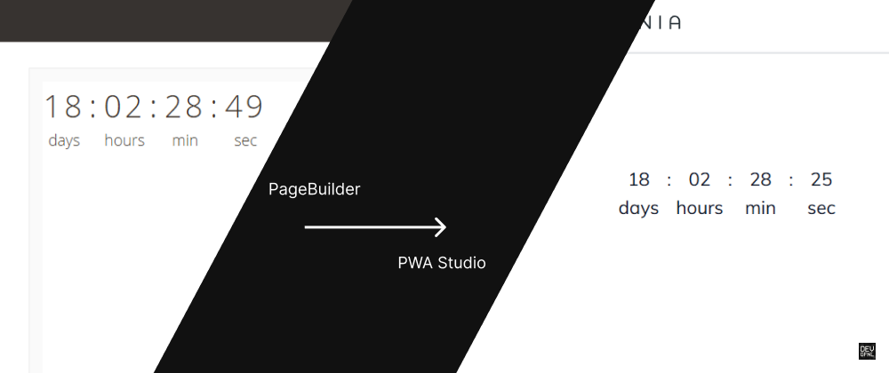

# Custom Countdown Content Type for PWA Studio

This repository contains the Magento module and the final code implementation from the tutorial. For step-by-step instructions, refer to the blog post: [How to Create a Custom Countdown Content Type in PWA Studio](https://dev.to/devgfnl/how-to-create-a-custom-countdown-content-type-in-pwa-studio-2je6).

## Magento Module

The Magento module used in the tutorial is based on [pagebuilder-examples](https://github.com/commerce-docs/pagebuilder-examples). However, this repository includes some slight modifications. You can explore the code for the updated module by clicking the following link:

- [Magento Module](./Example/)
- [Download the moodule](./doc/magento2-module-countdown.zip)

## PWA Studio Code

In this repository, you'll also find the final PWA Studio implementation used in the tutorial. Check out the code here:

- [PWA Studio Countdown Component](./pwa-studio/src/components/Countdown/)
